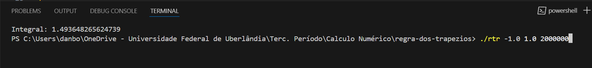

# Regra Dos Trapézios Repetidos 

A regra dos trapézios repetidos aproxima a integral de uma função contínua dividindo o intervalo de integração em subintervalos iguais. Em cada subintervalo, a função é aproximada por um trapézio, 
cuja área é calculada. A soma das áreas desses trapézios fornece a aproximação da integral. A fórmula é: 
\[
I \approx \frac{h}{2} \left[ f(a) + 2 \sum_{i=1}^{n-1} f(x_i) + f(b) \right]
\]
onde h é o tamanho do subintervalo e x𝑖 são os pontos intermediários. A precisão melhora com mais subintervalos.

# Como rodar

Para compilar use: `gcc -o rtr main.c -lm `
  - -lm pois estamos usando biblioteca matematica

  Já para roda use `./rtr 0.5 1e-12` 
  - Primeiro primeiro parametro é o executável
  - O segundo e o terceiro são os limites da integração 
  - O ultimo é o número de subdivisões do intervalo, quanto maior, mais preciso é o cálculo

  # A função
  A função usada no código é exp(-pow(x,2)) 
